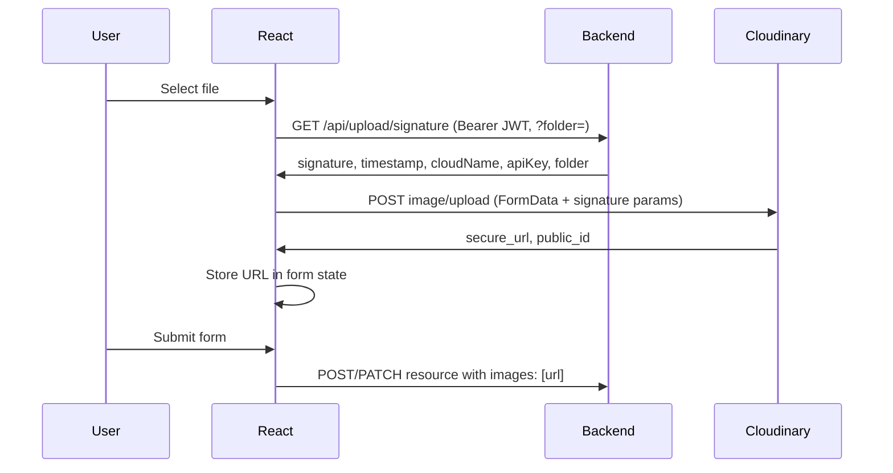

# React frontend plan: Cloudinary signed upload

## Backend contract (reference)

- **Endpoint:** `GET /api/upload/signature` (global prefix `api` from your Nest backend).
- **Auth:** `Authorization: Bearer <access_token>` (JWT).
- **Query:** `folder` (optional), e.g. `products`, `outlets`, `avatars`. Omit to use backend default (e.g. `zam-zam`).
- **Response:** `{ signature, timestamp, cloudName, apiKey, folder }`.

Your backend CORS allows `http://localhost:5173`, `zz-admin-zeta.vercel.app`, and `zz-user.vercel.app` with credentials.

---

## 1. Environment and API base

- **Env:** In the React repo, ensure you have a base URL for the backend (e.g. `VITE_API_URL=http://localhost:3000` or your deployed backend URL). Use it for all API calls so the upload signature request goes to `{{VITE_API_URL}}/api/upload/signature`.
- **Auth:** Use the same mechanism you use for other protected API calls (e.g. stored access token from login, or a hook like `useAuth` that exposes `getAccessToken()` or an axios/fetch instance that already attaches the Bearer token). The signature request **must** send the JWT; otherwise the backend returns 401.

---

## 2. Types (TypeScript)

Define a type for the signature response so the rest of the code is type-safe:

```ts
// e.g. types/upload.ts or api/upload.types.ts
export interface SignatureResponse {
  signature: string;
  timestamp: number;
  cloudName: string;
  apiKey: string;
  folder: string;
}
```

---

## 3. Fetch signature from your backend

Create a small API function that calls your backend and returns the signed params. It must use the same auth as your other API calls.

- **URL:** `GET ${API_BASE}/api/upload/signature` with optional `?folder=...`.
- **Headers:** `Authorization: Bearer <access_token>` (and `Content-Type` if needed; for GET usually not required).
- **Return:** Parse JSON and return as `SignatureResponse` (or throw on non-OK).

Example shape (adapt to your API client):

```ts
// e.g. api/upload.ts
const API_BASE = import.meta.env.VITE_API_URL; // or your env name

export async function getUploadSignature(
  folder?: string,
): Promise<SignatureResponse> {
  const url = folder
    ? `${API_BASE}/api/upload/signature?folder=${encodeURIComponent(folder)}`
    : `${API_BASE}/api/upload/signature`;
  const res = await fetch(url, {
    headers: {
      Authorization: `Bearer ${getAccessToken()}`, // use your auth helper
    },
    credentials: "include", // if you use cookies
  });
  if (!res.ok) throw new Error((await res.text()) || res.statusText);
  return res.json();
}
```

If you use **axios**: create an axios instance that already has the base URL and an interceptor that attaches the Bearer token, then use `axios.get<SignatureResponse>('/api/upload/signature', { params: { folder } })`.

---

## 4. Upload file to Cloudinary (browser)

Implement a function that takes a `File` and the signature params, then POSTs to Cloudinary’s upload URL. Do **not** send the file to your backend.

- **Cloudinary URL:** `https://api.cloudinary.com/v1_1/${cloudName}/image/upload`
- **Method:** `POST`
- **Body:** `FormData` with:
  - `file` → the `File`
  - `api_key` → from signature response
  - `timestamp` → from signature response (string)
  - `signature` → from signature response
  - `folder` → from signature response (optional but should match what was signed)

Example:

```ts
// e.g. api/cloudinary.ts or utils/cloudinaryUpload.ts
export async function uploadImageToCloudinary(
  file: File,
  params: SignatureResponse,
): Promise<{ secure_url: string; public_id: string }> {
  const formData = new FormData();
  formData.append("file", file);
  formData.append("api_key", params.apiKey);
  formData.append("timestamp", String(params.timestamp));
  formData.append("signature", params.signature);
  formData.append("folder", params.folder);

  const res = await fetch(
    `https://api.cloudinary.com/v1_1/${params.cloudName}/image/upload`,
    { method: "POST", body: formData },
  );
  if (!res.ok) {
    const err = await res.json().catch(() => ({}));
    throw new Error(err.error?.message || res.statusText || "Upload failed");
  }
  const data = await res.json();
  return { secure_url: data.secure_url, public_id: data.public_id };
}
```

Use `secure_url` when saving to your backend (e.g. product `images[]`, outlet `images[]`).

---

## 5. End-to-end flow in React

High-level flow:



- **Step 1:** User selects one or more images (file input or drag-and-drop).
- **Step 2:** For each file (or in parallel): call `getUploadSignature(folder)` then `uploadImageToCloudinary(file, params)`.
- **Step 3:** Collect all `secure_url` values and set them in your form state (e.g. `images: string[]`).
- **Step 4:** On form submit, send those URLs to your existing backend APIs (e.g. create product, update outlet) in the same format they expect (e.g. `images: ['https://...', ...]`).

---

## 6. Where to implement in the React repo

- **API layer:** Put `getUploadSignature` in the same place as your other API calls (e.g. `api/upload.ts` or `services/api/upload.ts`). Reuse your auth helper or axios instance so the signature request is authenticated.
- **Upload helper:** Put `uploadImageToCloudinary` in a shared util or the same API module (e.g. `api/cloudinary.ts` or `utils/cloudinaryUpload.ts`).
- **UI:** One of the following, depending on your preference:
  - **Option A – Hook:** `useImageUpload(folder?: string)` that returns something like `{ upload, loading, error }`. Inside, it calls `getUploadSignature(folder)`, then `uploadImageToCloudinary(file, params)`, and returns the `secure_url`. The component uses this hook and appends returned URLs to form state.
  - **Option B – Component:** An `ImageUpload` component that takes `folder`, `onSuccess(url: string)`, and optionally `onError`, `disabled`. It renders a file input; on change it runs the same two steps and calls `onSuccess(secure_url)`. Parent adds that URL to its form state (e.g. `setImages(prev => [...prev, url])`).
- **Forms:** In the screens where you create/edit products, outlets, or users (avatar), add the upload UI (hook or component), and ensure the payload you send to the backend includes the `images` or `avatar` URL(s) from state.

---

## 7. Folder choice per context

- Use a consistent `folder` for each resource type so Cloudinary stays organized and your backend’s default is respected:
  - Products: `folder: 'products'` (or whatever you use in backend).
  - Outlets: `folder: 'outlets'`.
  - Avatars: `folder: 'avatars'`.
- Pass this into `getUploadSignature(folder)` (and thus into your hook or component) so the signed params and the upload use the same folder.

---

## 8. Error handling and UX

- **401 on signature:** Redirect to login or refresh the token if you use refresh flow.
- **4xx/5xx from Cloudinary:** Show a short message (e.g. “Upload failed”) and optionally retry.
- **Loading:** Disable the file input and show a spinner or “Uploading…” while `getUploadSignature` + `uploadImageToCloudinary` are in progress.
- **Multiple files:** Either upload in sequence to avoid rate limits or in parallel (e.g. `Promise.all` over an array of files); collect all `secure_url` values and merge into `images[]`.

---

## 9. Checklist (frontend repo)

- Env variable for backend base URL; signature request uses `{{base}}/api/upload/signature`.
- Signature request sends JWT (Bearer) using existing auth.
- Type for signature response; type for Cloudinary response (`secure_url`, `public_id`).
- `getUploadSignature(folder?)` implemented and used only for upload (not for other APIs).
- `uploadImageToCloudinary(file, params)` implemented; only talks to Cloudinary, not your backend.
- Hook or component that wires signature → upload → URL; integrates with form state.
- Product/outlet/user forms use the upload UI and send returned URLs in the correct field (`images`, `avatar`, etc.).
- Folder set per context (products, outlets, avatars).
- Loading and error states and, if needed, multiple-file handling.

No backend or Postman changes are required; the backend already exposes the correct contract.
